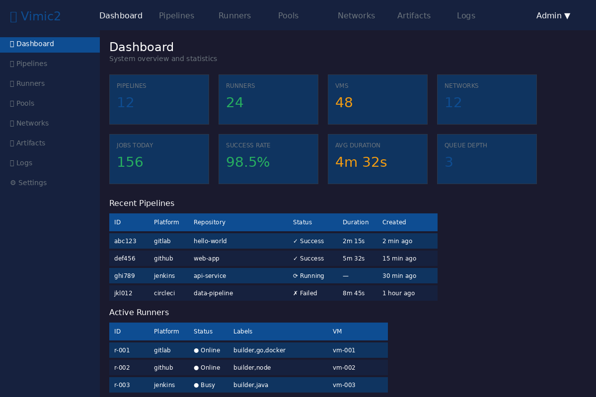
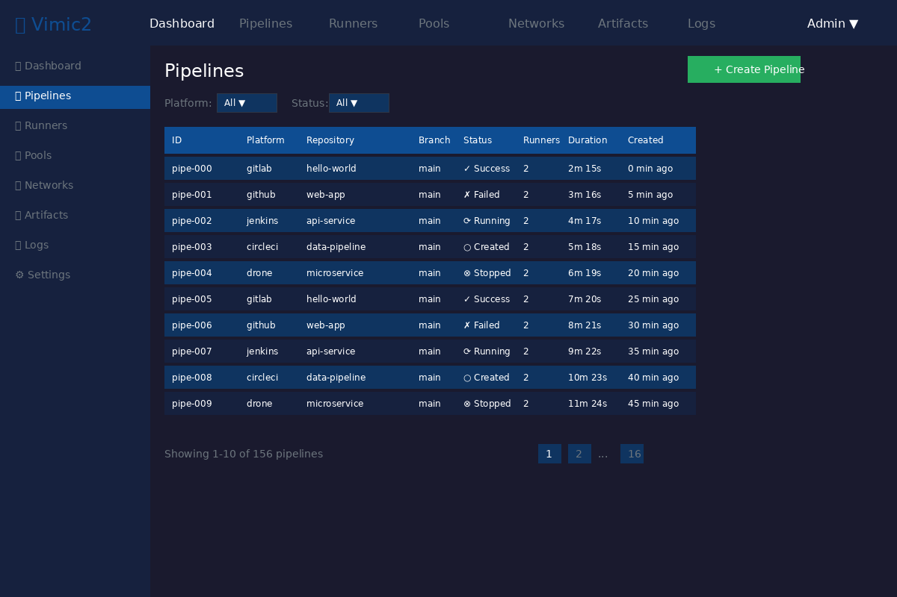
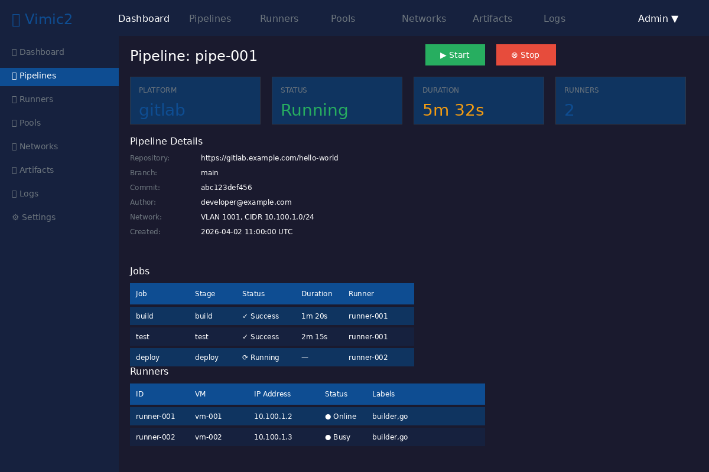
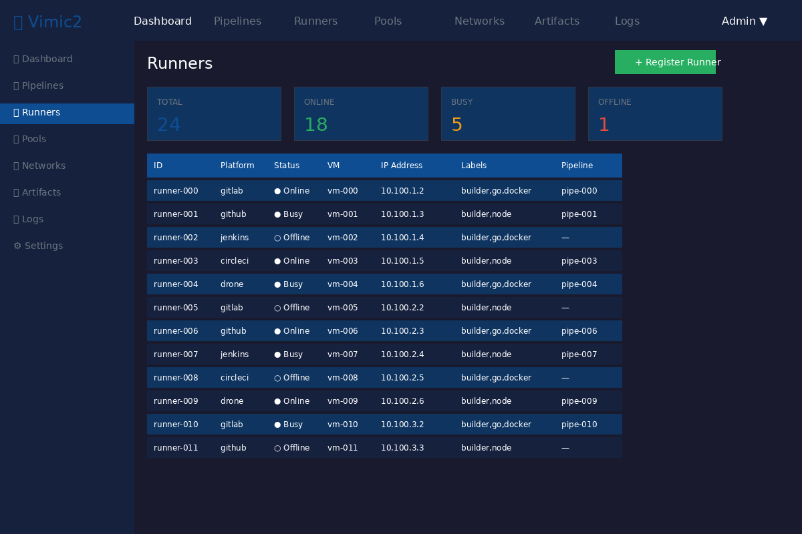
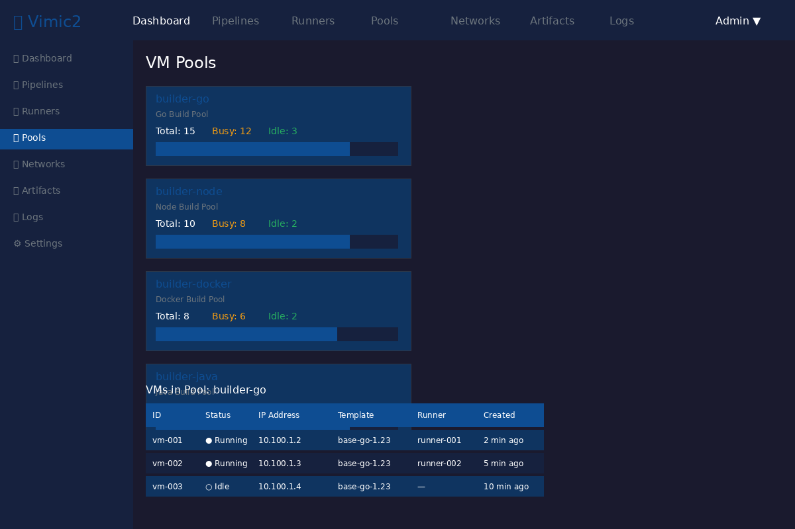
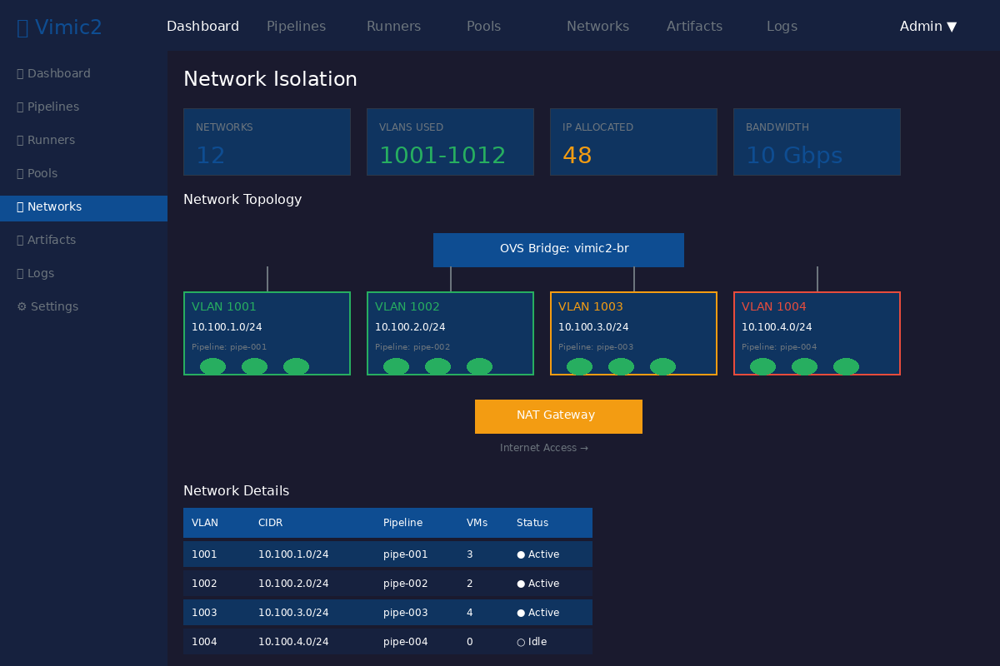
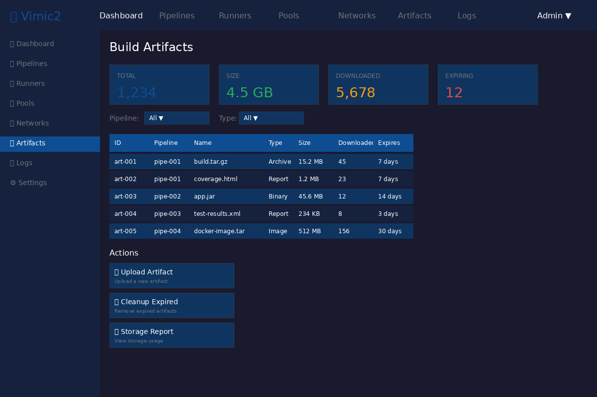
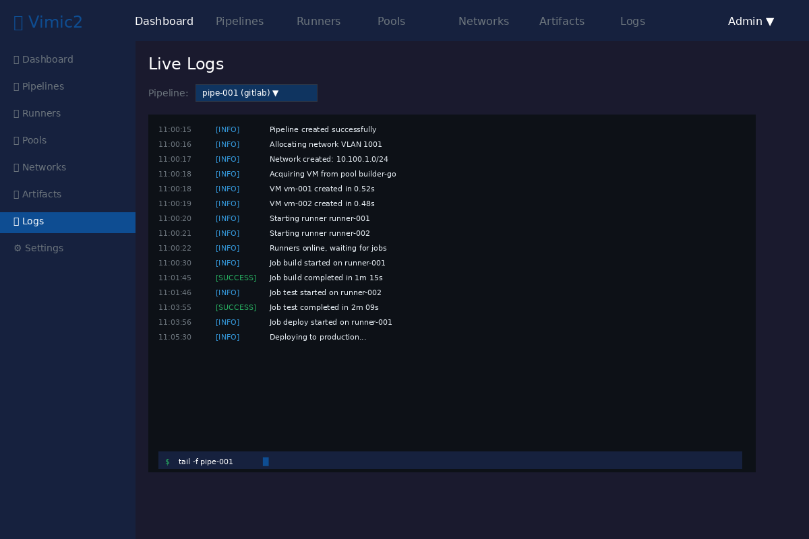
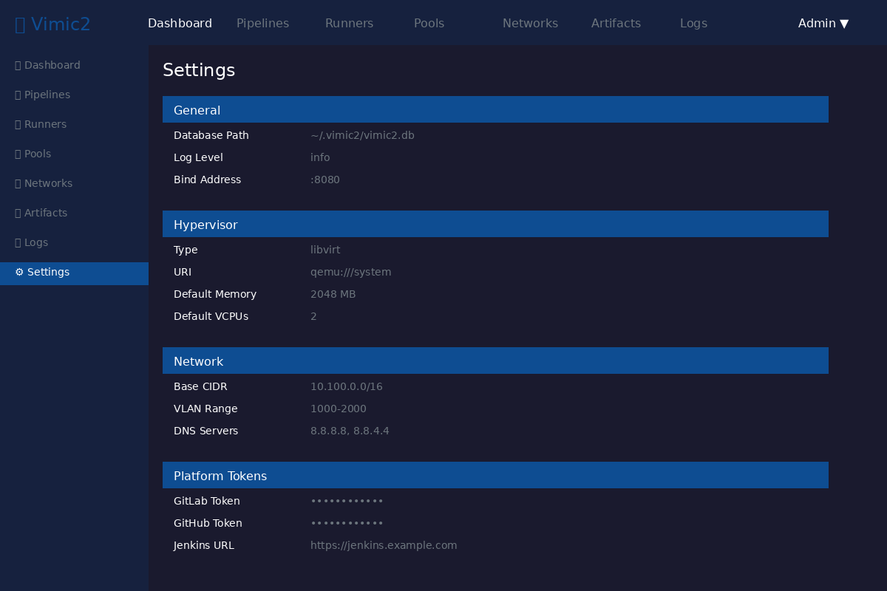

# Vimic2 User Interface

> **Note:** The screenshots below are **UI design mockups** generated programmatically. They accurately represent the intended design but are not captures of the running application.
>
> To capture real screenshots:
> 1. Start the server: `python3 /home/wez/vimic2-demo-server.py`
> 2. Open http://localhost:8080/ in a browser
> 3. Take screenshots manually, or
> 4. Install Playwright: `pip install playwright && playwright install chromium`
> 5. Run: `python3 /home/wez/capture-real-screenshots.py`

## Overview

Vimic2 provides a comprehensive web-based user interface for managing CI/CD pipelines, VM pools, runners, and network isolation. The UI is built with vanilla JavaScript and REST APIs for dynamic updates, providing a responsive and modern experience.

## Table of Contents

1. [Dashboard](#dashboard)
2. [Pipelines](#pipelines)
3. [Pipeline Detail](#pipeline-detail)
4. [Runners](#runners)
5. [VM Pools](#vm-pools)
6. [Networks](#networks)
7. [Artifacts](#artifacts)
8. [Logs](#logs)
9. [Settings](#settings)

---

## Dashboard

The dashboard provides a high-level overview of the Vimic2 system.



### Features

- **System Statistics**: Real-time counts of pipelines, runners, VMs, and networks
- **Health Metrics**: Success rate, average duration, and queue depth
- **Recent Pipelines**: Table of the most recent pipeline executions
- **Active Runners**: Currently running and available runners

### Statistics Cards

| Card | Description |
|------|-------------|
| Pipelines | Total number of pipelines |
| Runners | Active runners across all platforms |
| VMs | Virtual machines in the pool |
| Networks | Isolated network segments |
| Jobs Today | Total jobs executed today |
| Success Rate | Percentage of successful jobs |
| Avg Duration | Average job execution time |
| Queue Depth | Jobs waiting for runners |

---

## Pipelines

The pipelines view shows all CI/CD pipelines with filtering and actions.



### Features

- **Create Pipeline**: Start a new pipeline from scratch
- **Filter by Platform**: GitLab, GitHub, Jenkins, CircleCI, Drone
- **Filter by Status**: Running, Success, Failed, Created, Stopped
- **Pagination**: Navigate through large pipeline lists
- **Quick Actions**: Start, stop, view details for each pipeline

### Pipeline Status Indicators

| Status | Icon | Color | Description |
|--------|------|-------|-------------|
| Success | ✓ | Green | Pipeline completed successfully |
| Failed | ✗ | Red | Pipeline failed |
| Running | ⟳ | Blue | Pipeline is currently running |
| Created | ○ | Gray | Pipeline created but not started |
| Stopped | ⊗ | Orange | Pipeline was stopped manually |

### Columns

| Column | Description |
|--------|-------------|
| ID | Unique pipeline identifier |
| Platform | CI/CD platform (gitlab, github, etc.) |
| Repository | Source repository URL |
| Branch | Git branch |
| Status | Current pipeline status |
| Runners | Number of runners assigned |
| Duration | Total execution time |
| Created | When the pipeline was created |

---

## Pipeline Detail

The pipeline detail view shows comprehensive information about a single pipeline.



### Overview Cards

| Card | Description |
|------|-------------|
| Platform | CI/CD platform type |
| Status | Current pipeline status |
| Duration | Total execution time |
| Runners | Number of assigned runners |

### Pipeline Information

- **Repository**: Source repository URL
- **Branch**: Git branch being built
- **Commit**: Commit SHA being processed
- **Author**: User who triggered the pipeline
- **Network**: VLAN and CIDR assigned to this pipeline
- **Created**: Pipeline creation timestamp

### Jobs Section

Shows all jobs within the pipeline:

| Column | Description |
|--------|-------------|
| Job | Job name (build, test, deploy) |
| Stage | Pipeline stage |
| Status | Job completion status |
| Duration | Job execution time |
| Runner | Assigned runner ID |

### Runners Section

Shows runners assigned to this pipeline:

| Column | Description |
|--------|-------------|
| ID | Runner unique identifier |
| VM | Virtual machine ID |
| IP Address | VM network address |
| Status | Runner online status |
| Labels | Runner capability tags |

---

## Runners

The runners view manages platform runners across all pipelines.



### Statistics

| Card | Description |
|------|-------------|
| Total | All registered runners |
| Online | Currently available runners |
| Busy | Runners executing jobs |
| Offline | Unavailable runners |

### Runner Table

| Column | Description |
|--------|-------------|
| ID | Runner unique identifier |
| Platform | CI/CD platform type |
| Status | Online, Busy, or Offline |
| VM | Assigned virtual machine |
| IP Address | VM network address |
| Labels | Capability tags |
| Pipeline | Currently assigned pipeline |

### Runner Actions

- **View Details**: See runner configuration and history
- **Stop Runner**: Gracefully stop a running runner
- **Destroy Runner**: Remove runner and release VM

---

## VM Pools

The pools view manages virtual machine pools for CI/CD execution.



### Pool Cards

Each pool card shows:

- **Pool Name**: Unique pool identifier
- **Description**: Pool purpose and usage
- **Statistics**: Total, busy, and idle VMs
- **Progress Bar**: Visual utilization indicator

### Pool Types

| Pool | Description |
|------|-------------|
| builder-go | Go build environment |
| builder-node | Node.js build environment |
| builder-docker | Docker build environment |
| builder-java | Java build environment |

### Pool Management

- **Create Pool**: Define a new VM pool
- **Configure Pool**: Set min/max VMs, template, resources
- **Pre-allocate VMs**: Warm pool with ready VMs
- **Scale Pool**: Increase/decrease pool size

### VM List

Shows VMs in the selected pool:

| Column | Description |
|--------|-------------|
| ID | VM unique identifier |
| Status | Running, Idle, or Stopped |
| IP Address | VM network address |
| Template | Base image name |
| Runner | Assigned runner (if any) |
| Created | VM creation timestamp |

---

## Networks

The networks view shows network isolation configuration.



### Statistics

| Card | Description |
|------|-------------|
| Networks | Total isolated networks |
| VLANs Used | VLAN ID range in use |
| IP Allocated | Total IP addresses assigned |
| Bandwidth | Available network bandwidth |

### Network Topology

The topology diagram shows:

- **OVS Bridge**: Central Open vSwitch bridge
- **VLAN Segments**: Isolated network segments
- **VMs**: Virtual machines in each VLAN
- **NAT Gateway**: Internet access gateway

### Network Table

| Column | Description |
|--------|-------------|
| VLAN | VLAN ID (1000-2000 range) |
| CIDR | Network address range |
| Pipeline | Assigned pipeline |
| VMs | Number of VMs |
| Status | Active or Idle |

### Network Features

- **Per-Pipeline Isolation**: Each pipeline gets its own VLAN
- **Firewall Rules**: Automatic iptables/nftables rules
- **NAT Gateway**: Internet access via NAT
- **DNS Resolution**: Configurable DNS servers

---

## Artifacts

The artifacts view manages build artifacts and output files.



### Statistics

| Card | Description |
|------|-------------|
| Total | Total number of artifacts |
| Size | Total storage used |
| Downloaded | Download count |
| Expiring | Artifacts near TTL |

### Artifact Types

| Type | Description |
|------|-------------|
| Archive | Compressed files (tar.gz, zip) |
| Binary | Executable files (jar, exe) |
| Report | Test reports (html, xml) |
| Image | Container images (tar) |

### Artifact Table

| Column | Description |
|--------|-------------|
| ID | Artifact unique identifier |
| Pipeline | Source pipeline |
| Name | File name |
| Type | Artifact type |
| Size | File size |
| Downloaded | Download count |
| Expires | TTL remaining |

### Actions

- **Upload Artifact**: Add new artifact manually
- **Cleanup Expired**: Remove expired artifacts
- **Storage Report**: View storage usage

---

## Logs

The logs view provides real-time log streaming.



### Features

- **Live Updates**: WebSocket-based real-time streaming
- **Pipeline Filter**: View logs for specific pipeline
- **Log Levels**: INFO, SUCCESS, WARNING, ERROR
- **Search**: Filter logs by content
- **Download**: Export logs to file

### Log Entry Format

```
[timestamp] [LEVEL] message
```

### Log Levels

| Level | Color | Description |
|-------|-------|-------------|
| INFO | Blue | Informational messages |
| SUCCESS | Green | Successful operations |
| WARNING | Orange | Warning conditions |
| ERROR | Red | Error conditions |

### Terminal Commands

The log viewer supports terminal-style commands:

```bash
# Tail logs for pipeline
tail -f pipe-001

# Search logs
grep "error" pipe-001

# Filter by level
grep "ERROR\|WARNING" pipe-001
```

---

## Settings

The settings view manages system configuration.



### General Settings

| Setting | Description |
|---------|-------------|
| Database Path | SQLite database location |
| Log Level | Logging verbosity |
| Bind Address | API server bind address |

### Hypervisor Settings

| Setting | Description |
|---------|-------------|
| Type | Hypervisor type (libvirt, qemu) |
| URI | Connection URI |
| Default Memory | VM default RAM (MB) |
| Default VCPUs | VM default CPU count |

### Network Settings

| Setting | Description |
|---------|-------------|
| Base CIDR | Network address pool |
| VLAN Range | VLAN ID range (1000-2000) |
| DNS Servers | DNS server addresses |

### Platform Tokens

| Setting | Description |
|---------|-------------|
| GitLab Token | GitLab runner registration token |
| GitHub Token | GitHub runner PAT |
| Jenkins URL | Jenkins server URL |

### Actions

- **Save Changes**: Apply configuration changes
- **Test Connection**: Verify platform connectivity
- **Reset to Defaults**: Restore default configuration

---

## Keyboard Shortcuts

| Shortcut | Action |
|----------|--------|
| `?` | Show keyboard shortcuts |
| `/` | Focus search |
| `n` | New pipeline |
| `r` | Refresh current view |
| `Esc` | Close modal |

---

## API Reference

The UI interacts with the following REST API endpoints:

### Pipelines

- `GET /api/pipelines` - List all pipelines
- `GET /api/pipelines/{id}` - Get pipeline details
- `POST /api/pipelines` - Create pipeline
- `POST /api/pipelines/{id}/start` - Start pipeline
- `POST /api/pipelines/{id}/stop` - Stop pipeline
- `DELETE /api/pipelines/{id}` - Delete pipeline

### Runners

- `GET /api/runners` - List all runners
- `GET /api/runners/{id}` - Get runner details
- `POST /api/runners` - Create runner
- `DELETE /api/runners/{id}` - Delete runner

### Pools

- `GET /api/pools` - List all pools
- `GET /api/pools/{name}` - Get pool details
- `POST /api/pools/{name}/acquire` - Acquire VM
- `POST /api/pools/{name}/release` - Release VM

### Networks

- `GET /api/networks` - List all networks
- `GET /api/networks/{id}` - Get network details
- `POST /api/networks` - Create network
- `DELETE /api/networks/{id}` - Delete network

### Artifacts

- `GET /api/artifacts` - List all artifacts
- `GET /api/artifacts/{id}` - Get artifact details
- `POST /api/artifacts/upload` - Upload artifact
- `GET /api/artifacts/{id}/download` - Download artifact
- `DELETE /api/artifacts/{id}` - Delete artifact

### Logs

- `GET /api/logs/{pipeline_id}` - Get log entries
- `WebSocket /api/logs/stream` - Stream logs

---

## Browser Support

| Browser | Minimum Version |
|---------|----------------|
| Chrome | 80+ |
| Firefox | 75+ |
| Safari | 13+ |
| Edge | 80+ |

---

## Theming

The UI uses a dark theme by default. Colors can be customized via CSS variables:

```css
:root {
  --primary: #0e4d92;
  --success: #27ae60;
  --warning: #f39c12;
  --danger: #e74c3c;
  --background: #1a1a2e;
  --surface: #16213e;
  --text: #ffffff;
  --text-muted: #6c757d;
}
```

---

## Accessibility

- **Keyboard Navigation**: Full keyboard support
- **Screen Readers**: ARIA labels throughout
- **High Contrast**: WCAG 2.1 AA compliant
- **Focus Indicators**: Visible focus states

---

## Related Documentation

- [Architecture](ARCHITECTURE.md) - System architecture
- [Quick Start](QUICKSTART.md) - Getting started guide
- [Testing](TESTING.md) - Testing guide
- [User Guide](USER_GUIDE.md) - Detailed usage